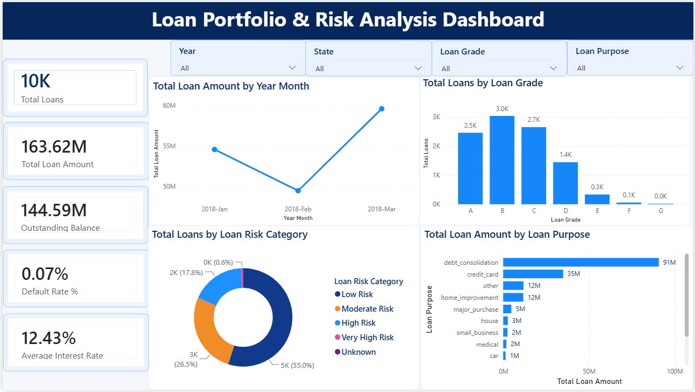
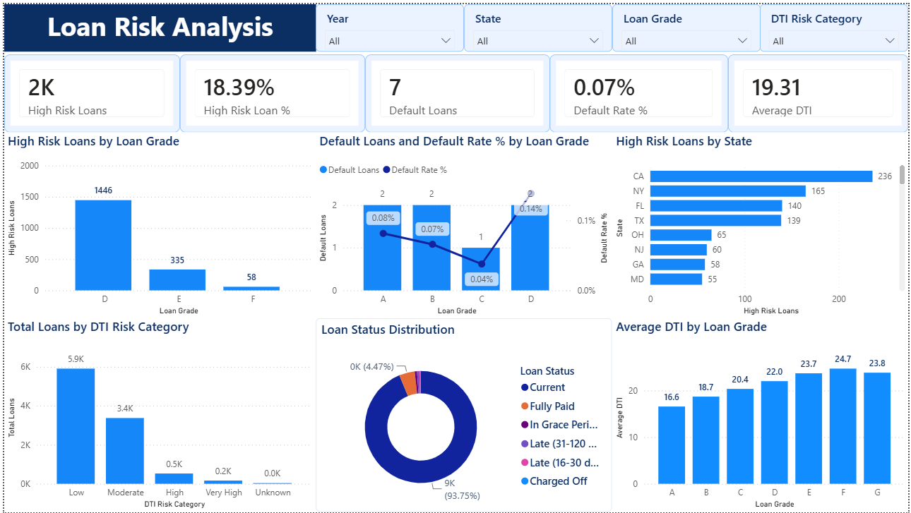

# Banking Loan Credit Risk Analytics Dashboard

## Project Overview

This project presents an interactive **Banking Loan & Credit Risk Analytics Dashboard** developed using **Microsoft Power BI**.

The dashboard analyzes a banking loan portfolio to provide insights into loan distribution, portfolio value, outstanding balances, borrower risk, default rates, debt-to-income (DTI) levels, loan grades, and geographic risk patterns.

The project demonstrates an end-to-end Power BI workflow including **data preparation, data modeling, DAX measure creation, KPI development, interactive filtering, risk analysis, and dashboard design**.

---

## Project Objectives

The main objectives of this project are to:

- Analyze the overall size and value of the loan portfolio.
- Monitor outstanding loan balances and average interest rates.
- Identify high-risk loans and borrower risk patterns.
- Analyze loan defaults and default rates.
- Compare loan performance across different loan grades.
- Understand the distribution of loans across different purposes.
- Analyze borrower risk using Debt-to-Income (DTI) ratios.
- Identify geographic areas with higher concentrations of risky loans.
- Provide an interactive dashboard for exploring loan portfolio performance.

---

## Dashboard Pages

The Power BI report contains two analytical pages:

### 1. Executive Overview

The Executive Overview provides a high-level summary of the overall loan portfolio.

#### Key KPIs

- Total Loans
- Total Loan Amount
- Outstanding Balance
- Default Rate %
- Average Interest Rate

#### Key Visualizations

- Total Loan Amount by Year-Month
- Total Loans by Loan Grade
- Total Loans by Loan Risk Category
- Total Loan Amount by Loan Purpose

#### Interactive Filters

Users can dynamically filter the dashboard using:

- Year
- State
- Loan Grade
- Loan Purpose

### Executive Overview Dashboard



---

### 2. Loan Risk Analysis

The Loan Risk Analysis page focuses specifically on identifying and understanding credit-risk patterns within the loan portfolio.

#### Key KPIs

- High Risk Loans
- High Risk Loan %
- Default Loans
- Default Rate %
- Average DTI

#### Key Visualizations

- High Risk Loans by Loan Grade
- Default Loans and Default Rate % by Loan Grade
- High Risk Loans by State
- Total Loans by DTI Risk Category
- Loan Status Distribution
- Average DTI by Loan Grade

#### Interactive Filters

The page can be filtered using:

- Year
- State
- Loan Grade
- DTI Risk Category

### Loan Risk Analysis Dashboard



---

## Data Modeling

The project uses a structured Power BI data model to organize loan-related information and support efficient analysis.

The model separates the primary loan transaction data from supporting dimensions where appropriate, enabling relationships between fields such as:

- Loan information
- Date
- Geography
- Loan grade
- Loan status
- Risk categories

This structure makes the dashboard easier to analyze and allows DAX measures to respond dynamically to filters and slicers.

---

## DAX Measures

Several DAX measures were created to calculate important portfolio and risk metrics, including:

- Total Loans
- Total Loan Amount
- Outstanding Balance
- Average Interest Rate
- Average DTI
- High Risk Loans
- High Risk Loan %
- Default Loans
- Default Rate %
- Total Principal Paid
- Total Interest Paid
- Total Late Fees

These measures allow the dashboard KPIs and visualizations to update dynamically based on user selections.

---

## Risk Analysis

The project classifies and evaluates loans using multiple risk indicators.

### Loan Risk Category

Loans are analyzed using risk categories to help distinguish between lower-risk and higher-risk portions of the portfolio.

### DTI Risk Category

Debt-to-Income ratio is used to group borrowers into different DTI risk levels, helping identify borrowers carrying relatively higher debt obligations.

### Loan Grade Analysis

Loan grades are analyzed alongside high-risk loans, defaults, default rates, and average DTI to identify differences in credit quality across the portfolio.

---

## Key Insights

The dashboard enables users to identify:

- Which loan grades contain the highest concentration of high-risk loans.
- How default rates vary across loan grades.
- Which states have the highest number of high-risk loans.
- How loans are distributed across different DTI risk categories.
- How average DTI changes across loan grades.
- Which loan purposes account for the largest share of lending.
- How the overall loan portfolio changes over time.
- The distribution of current, fully paid, late, charged-off, and other loan statuses.

---

## Tools & Technologies

- **Microsoft Power BI** – Dashboard development and visualization
- **Power Query** – Data cleaning and transformation
- **DAX (Data Analysis Expressions)** – Measures and KPI calculations
- **Data Modeling** – Relationships and analytical model design
- **CSV** – Source dataset
- **GitHub** – Project documentation and version hosting

---

## Repository Structure

```text
Banking-Loan-Credit-Risk-Analytics-Dashboard/
│
├── Banking_Loan_Credit_Risk_Dashboard.pbix
├── banking_loan_data.csv
├── README.md
│
└── screenshots/
    ├── Executive_Overview.png
    └── Risk_Analysis.png
